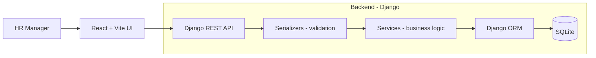

# Architecture

> High-level architecture defined upfront, before any production code. This is
> the whiteboard-level shape a team would agree on at kickoff. Implementation
> details (endpoint payloads, method signatures, indexes, etc.) will be
> committed alongside the code that introduces them.

## 1. Goal and persona

Build a salary management tool used by a single **HR Manager** persona for an
organization of ~10,000 employees. The tool must:

1. Provide CRUD on employees through a REST API.
2. Compute salary insights server-side (per country, per job-title within a
   country, and a small set of additional HR-relevant metrics).
3. Support a deterministic, fast seed of 10,000 employees.

Non-goals (intentional): authentication / authorization, multi-tenancy,
currency conversion, audit logging, soft-deletes.

## 2. High-level shape

Principle: **HTTP, validation, business logic, and persistence are distinct
layers.** Views never embed aggregation logic; they call into a service.

## 3. Repository layout

Top-level layout is in [`README.md`](../README.md). Within the backend, the
`employees` app is the **single** Django app — it owns the `Employee` model,
CRUD endpoints, the insights service module, the seeding management
command, and their tests. The detailed file layout lands as scaffolding does.

## 4. Module boundaries

| Layer | Owns | Forbidden from |
|-------|------|----------------|
| HTTP (views) | Routing, request/response. | Aggregation, raw ORM queries beyond `get_object_or_404`. |
| Serializers | Input/output shape, field-level validation. | Persistence side effects. |
| Services | Business logic + aggregation queries. | HTTP concerns. |
| Models | Schema, constraints, indexes. | Presentation. |
| Management commands | Bulk operations (e.g. seeding). | HTTP concerns. |

## 5. Where insights live

Inside the `employees` app, as a service module — not a separate Django app.
See [ADR 0001](adr/0001-insights-as-service-module.md) for the reasoning.

## 6. CRUD implementation trajectory

CRUD endpoints land first as **separate views**, one per operation, each
behind its own failing test. A dedicated refactor commit later collapses
them into a DRF `ModelViewSet` without changing tests or the URL contract.
See [ADR 0002](adr/0002-views-then-viewset-refactor.md).

## 7. Data model (intent, not schema)

A single `Employee` aggregate captures: identity (`first_name` + `last_name`
stored, `full_name` exposed as a derived property; plus `email`), role
(job title, department, employment type), location (country), compensation
(salary, currency — default `INR`), tenure (date of joining), and audit
timestamps. Country and job title are filter / group-by dimensions and will
be indexed when a test requires it.

Detailed field types, lengths, and indexes are committed with the migration
that introduces them.

## 8. Error model

All non-2xx API responses share a uniform envelope so the frontend has one
error contract to handle. Concrete shape will be locked alongside the first
endpoint test.

## 9. Seeding strategy

A management command bulk-creates 10,000 employees from
`first_names.txt` + `last_names.txt`, using a seeded RNG for determinism
and `bulk_create` (batched) for speed. Wrapped in a single transaction.
Performance budget is set by a test, not by guesswork.

## 10. Testing layers

- **Unit** — services, validators, helpers (millisecond-fast, no HTTP).
- **API integration** — view routing + serializer + status + payload using
  DRF's test client.
- **Seeder** — correctness + a performance budget assertion.

The suite must stay fast and deterministic; no time, randomness, or
network in tests unless explicitly controlled.

## 11. CI strategy

- **Phase 1 (backend-first)**: `ruff` + `pytest` on every push / PR.
- **Phase 2 (after frontend lands)**: add frontend lint / test / build.

## 12. Change control

Architecture-level changes require:

1. A new ADR in `docs/adr/`.
2. A short note in this document.
3. Landing the change behind a failing test (TDD).
