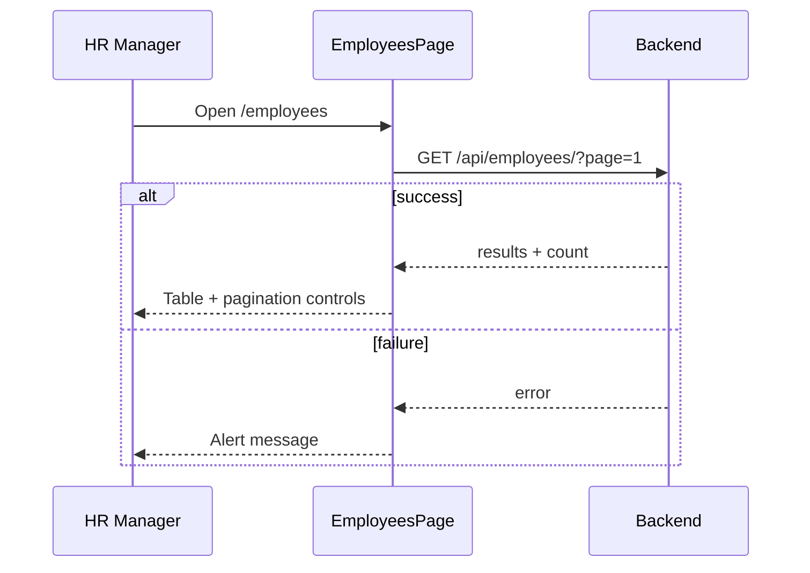
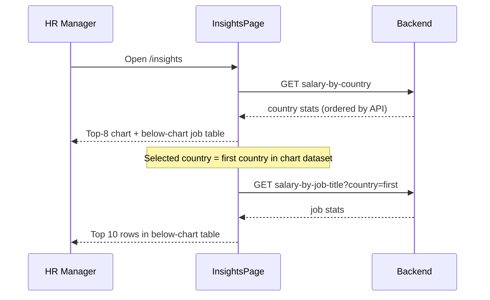

# Frontend UX flows (MVP)

> Step-by-step behavior for HR Manager tasks. Layouts are in
> [wireframes.md](wireframes.md); tokens in [design-system.md](design-system.md).

## Conventions

- **Loading**: show skeleton or spinner in the region being filled; do not
  block the whole app shell.
- **Error**: inline `role="alert"` on the page or dialog; user can retry by
  refreshing or repeating the action.
- **Empty**: explicit message (e.g. “No employees on this page”) — not a blank
  table.
- **Single selection**: on `/insights`, only **one country at a time** drives
  the below-chart salary-by-job table (default or latest bar click).

## API touchpoints

| Flow | Method | Endpoint |
|------|--------|----------|
| List employees | GET | `/api/employees/?page={n}` |
| Create employee | POST | `/api/employees/` |
| Update employee | PATCH | `/api/employees/{id}/` |
| Delete employee | DELETE | `/api/employees/{id}/` |
| Country salary stats | GET | `/api/insights/salary-by-country/` |
| Job title stats | GET | `/api/insights/salary-by-job-title/?country={name}` |

Country insights return a **full array** today; the salary-by-country **list
view** paginates in the **client** (slice + previous/next) until the API adds
server pagination.

---

## Employees

### 1. View paginated directory

- **Next / Previous**: requests `page ± 1`; disables control when no further
  page exists.
- **Page size**: 50 (API default); not user-configurable in v1.

### 2. Add employee

1. User clicks **Add Employee** → add dialog opens (empty form).
2. User fills required fields → **Save**.
3. On success: dialog closes, current page reloads (new row may appear on page
   1 if sort places it elsewhere — acceptable for v1).
4. On validation/API error: dialog stays open; error shown in dialog or page
   alert.

### 3. Edit employee

1. User clicks **Edit** on a row → edit dialog opens with prefilled values.
2. **Save** → PATCH → on success close dialog and reload **current** page.
3. On error: dialog remains open with message.

### 4. Delete employee

1. User clicks **Delete** → confirm dialog names the employee.
2. **Delete** → DELETE → on success close dialog and reload current page.
3. **Cancel** or **X** → close without API call.

---

## Salary Insights — chart view (`/insights`)

### 5. Initial load

1. Fetch all country stats; chart shows **top 8** (by average salary unless
   product specifies otherwise — match chart TDD).
2. Set **selected country** to the **first country** in that top-8 set.
3. Fetch job-title stats for selected country; render **top 10** in the
   below-chart table (client-side slice if API returns more).

### 6. Change country via chart (single selection)

1. User clicks a **bar** for country C.
2. Replace selected country with C (previous selection discarded).
3. Fetch job-title stats for C; update below-chart table title and rows.
4. While loading: keep prior table or show loading state in table region.

### 7. Open full job-title list (modal)

1. User clicks **View all job titles** under the below-chart table.
2. Modal opens titled for **current selected country**.
3. Fetch job-title stats (same endpoint); show **full** list in modal.
4. Close via **X**, backdrop click, or Escape.

### 8. Go to salary-by-country list

1. User clicks **View all** on the chart card.
2. Navigate to `/insights/countries` (chart + below-chart table hidden).
3. Load country stats (reuse cached response if still fresh; otherwise refetch).
4. Show **paginated** table of all countries.

---

## Salary Insights — country list (`/insights/countries`)

### 9. Browse paginated countries

1. User sees all countries from salary-by-country response, **one page at a
   time** (client pagination).
2. **Previous / Next** changes page index; no multi-select.

### 10. Drill down from a country row

1. User **clicks a row** (entire row is the hit target).
2. Modal opens for that country’s job-title salaries (same modal as flow 7).
3. Fetch on open; show loading in modal until rows arrive.
4. Close modal → user remains on list view at same page index.

### 11. Return to chart view

1. User clicks **Back to insights** (or equivalent).
2. Navigate to `/insights`.
3. Restore chart + below-chart table; **selected country** resets to **first
   country on chart** (same as initial load) unless a later slice persists
   selection — document in TDD if persistence is required.

---

## Job titles modal (shared)

Used by flows **7** and **10**.

| State | UX |
|-------|-----|
| Opening | Modal visible; title includes country name |
| Loading | Empty table or spinner inside modal |
| Success | Full job-title rows (min / max / avg) |
| Error | Alert inside modal; user can close and retry |
| Empty country | “No job titles found for {country}” |

---

## Navigation map

| From | Action | To |
|------|--------|-----|
| Sidebar | Employees | `/employees` |
| Sidebar | Salary Insights | `/insights` |
| Chart card | View all | `/insights/countries` |
| Country list | Back to insights | `/insights` |

---

## Out of scope (v1)

Search/filter on employees, export, KPI strips, chart click opening modal
directly (bar click only updates below-chart table), multi-country comparison,
and extra sidebar destinations from mockups.
